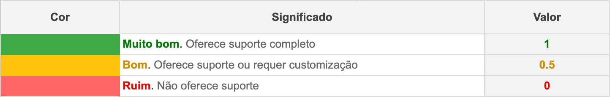
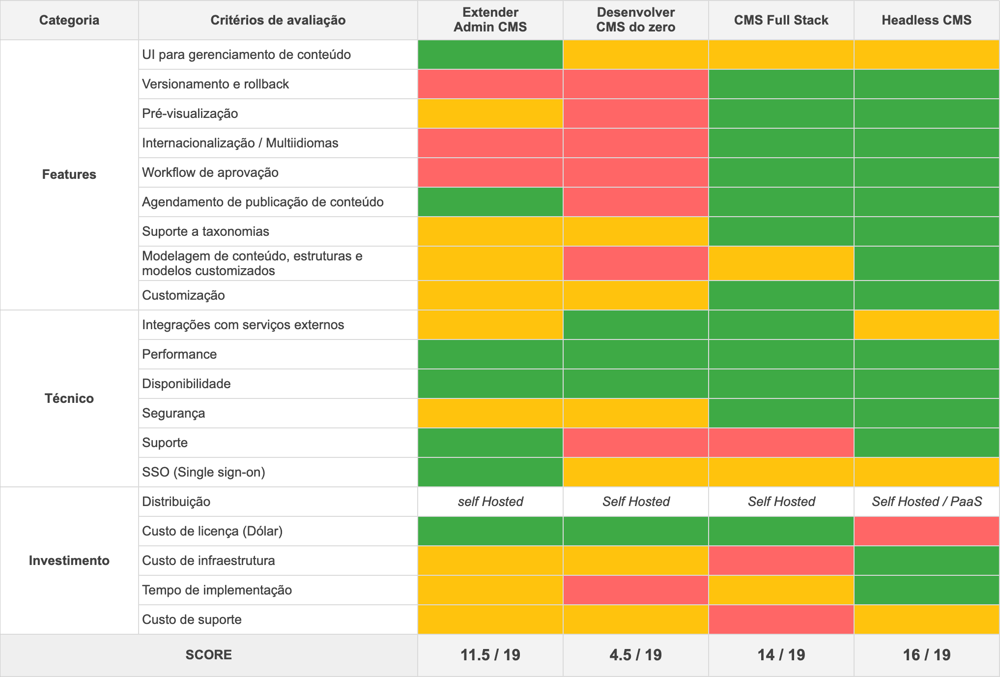
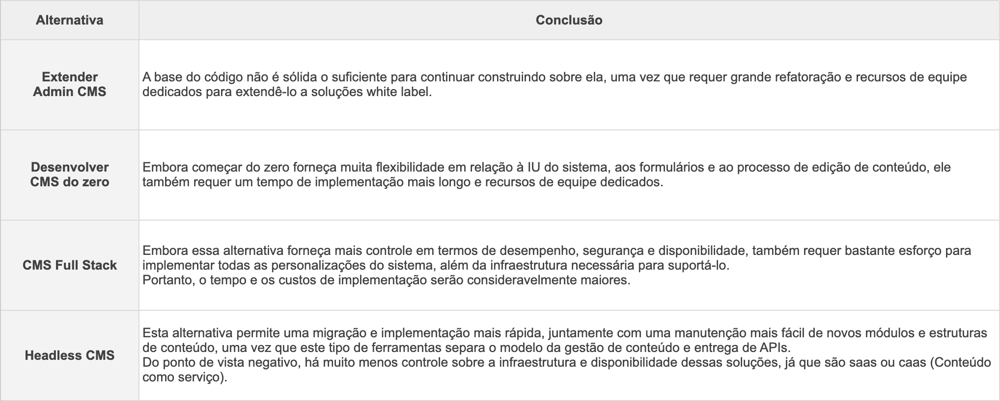
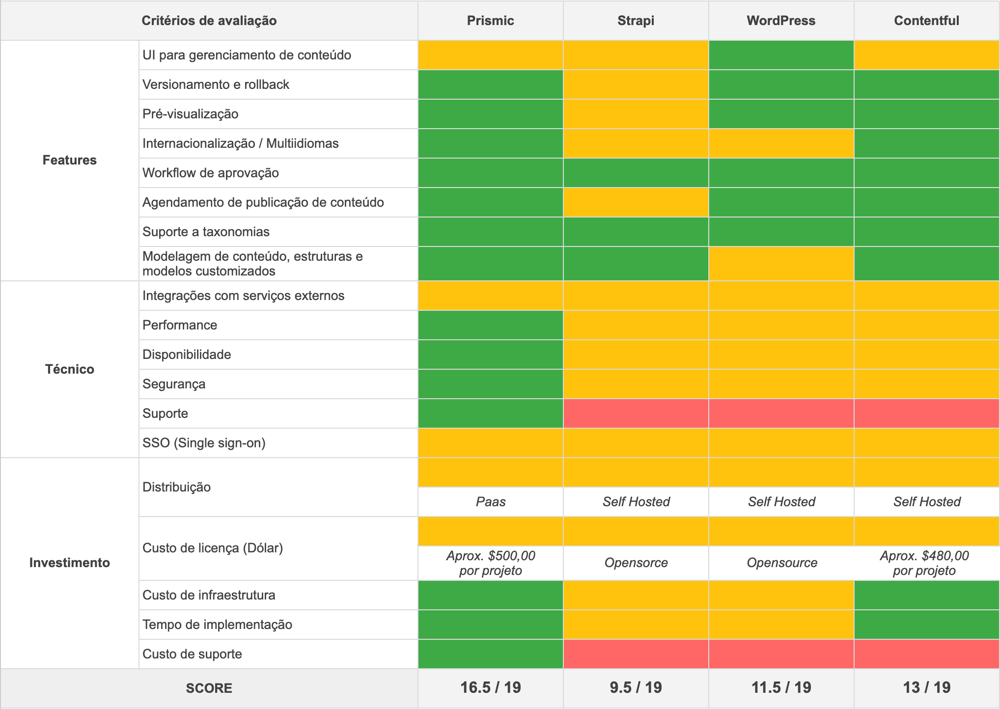
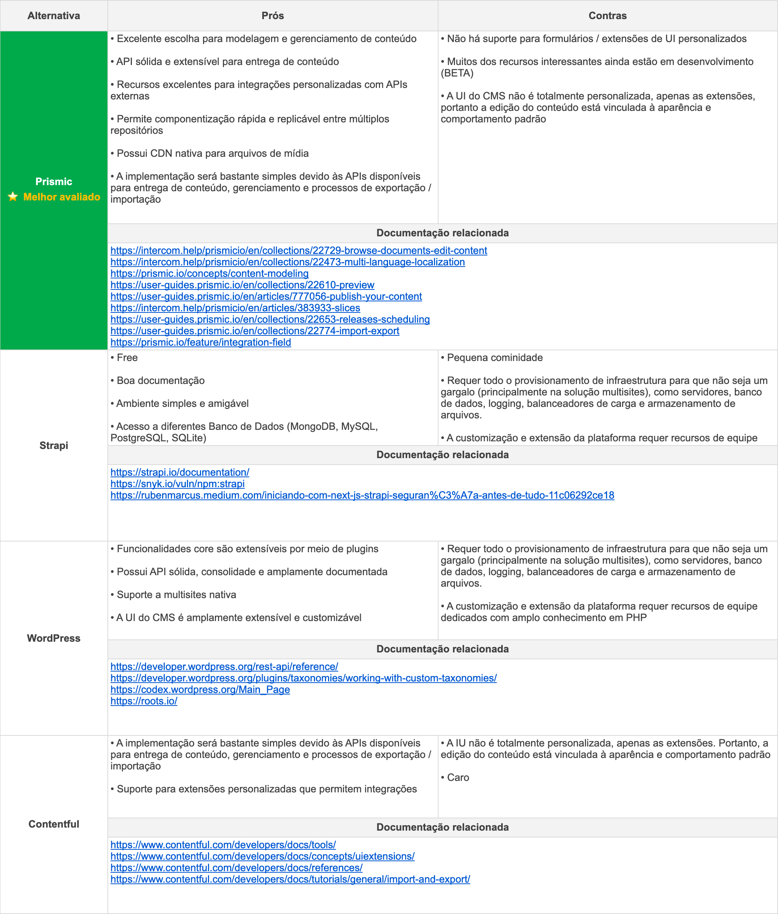

[← voltar](https://github.com/grupoboticario/stargate/tree/main#prismic-headless-cms)

# ​ Prismic

- [Headless CMS Benchmark: Por que escolhemos o Prismic?](#benchmark)
  - [Fase I: Análise de abordagens disponíveis](#abordagens)
  - [Fase I: Conclusões](#conclusoes-abordagens)
  - [Fase II: Benchmark entre Headless CMS](#headless-benchmark)
  - [Fase II: Conclusões](#headless-conclusoes)

**Stargate: Prismic - Documentação Relacionada:**
&emsp; [📄 &nbsp; Prismic: Content Modeling](https://github.com/grupoboticario/stargate/tree/main/docs/prismic.md) 
&emsp; [📄 &nbsp; Stargate: Prismic Documents](https://github.com/grupoboticario/stargate/tree/main/docs/prismic-stargate-documents.md)

---

## Headless CMS Benchmark: Por que escolhemos o Prismic? 
> O *Prismic* foi escolhido por apresentar a melhor pontuação no benchmark realizado pela equipe de [portais de venda direta](https://github.com/orgs/grupoboticario/teams/squad-portais), faseado em duas etapas:

1. Consideração das `abordagens disponíveis` e pontuação a partir dos critérios de avaliação considerados relevantes para a `experiência dos desenvolvedores`, `equipe de conteúdo` e para o `negócio`.
2. Definida a abordagem na primeira fase, mapear e comparar as principais ferramentas disponíveis no mercado.

*Critérios de pontuação:*

### Fase I: Análise de abordagens disponíveis 
> Foram consideradas as seguintes abordagens possíveis: `Extender o Admin CMS`, `Desenvolver um CMS do Zero`, `CMS Full Stack` e `Headless CMS`.

### Fase I: Conclusões 

---

### Fase II: Benchmark entre Headless CMS 
> Definida a estratégia de seguir por uma solução de Headless CMS, conduzimos o benchmark comparando as principais ferramentas de mercado: `WordPress`, `Strapi`, `Contentful` e `Prismic`.

### Fase II: Conclusões 

