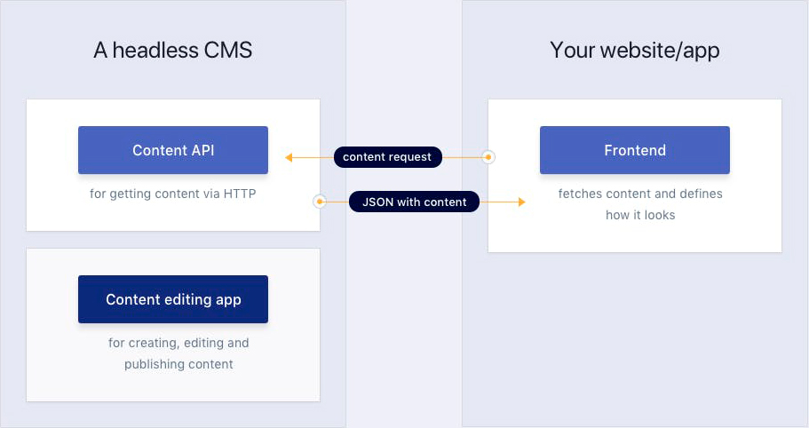
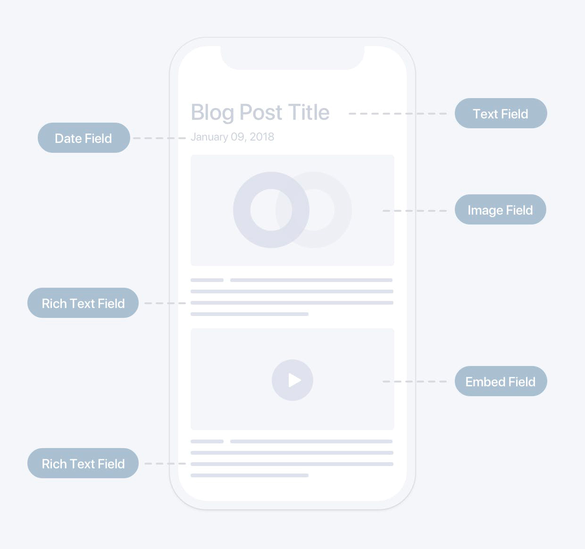
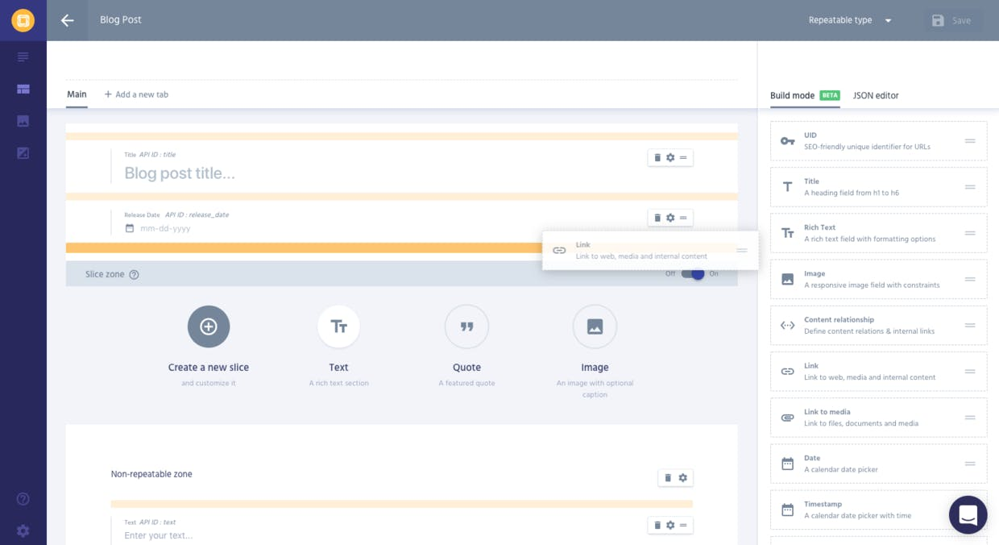
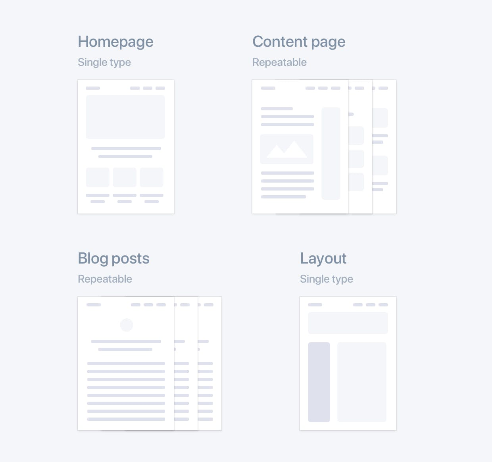
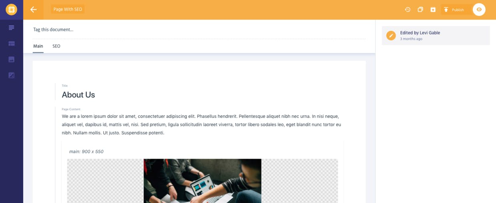

[← voltar](https://github.com/grupoboticario/stargate/tree/main#prismic-headless-cms)

# ​ Prismic

- [Sobre o Prismic](#sobre-o-prismic)
- [Modelagem de conteúdo](#modelagem-de-conteudo)
  - [Workflow](#workflow)
  - [Custom Types & Documents](#custom-types-documents)
  - [Custom Types](#custom-types)
  - [Documents](#documents)
  - [Slices](#slices)

**Stargate: Prismic - Docs** 
&emsp;[📄 &nbsp; Stargate - Headless CMS Bechmark: Por que escolhemos o Prismic?](https://github.com/grupoboticario/stargate/tree/main/docs/prismic-headless-benchmark.md) 
&emsp;[📄 &nbsp; Stargate: Prismic Documents](https://github.com/grupoboticario/stargate/tree/main/docs/prismic-stargate-documents.md)

---

## Sobre o Prismic 
O **Prismic** é o <a href="https://en.wikipedia.org/wiki/Headless_content_management_system" target="_blank">Headless CMS 🔗</a> utilizado pelos portais de venda direta gerados a partir do 👾 &nbsp; **Stargate** e que tem o objetivo de servir um repositório de conteúdo, disponibilizando os dados através de requisições em uma api `RESTFul/GraphQl` para exibição de conteúdo em múltiplos dispositivos. 👉 &nbsp; [Documentação oficial](https://prismic.io/docs)

---

## Modelagem de conteúdo 
> O Content model `(Modelo de conteúdo)` define a estrutura de todo o conteúdo de um website ou app.
De forma similar à modelagem de um banco de dados, o processo de estruturar o conteúdo é chamado de `content modeling / modelagem de conteúdo`.

---

### Workflow 
> O Workflow abaixo é apenas uma sugestão a partir de um fluxo linear e pode variar entre projetos, uma vez que algumas etapas podem ocorrer simultâneamente ou em casos em que o conteúdo é criado nas fases iniciais do projeto:

1. `Especificações do projeto`
2. `Arquitetura de informação`
3. `Sketches/Wireframes`
4. 👉 &nbsp; `Modelagem de conteúdo`
5. `Criação de Conteúdo`
6. `Desenvolvimento Front-end`

> ⚠️ &nbsp; Independente do workflow utilizado, a modelagem de conteúdo só deve ser feita quando você já sabe como será a estrutura visual do conteúdo. Caso contrário, o `modelo de conteúdo` pode se tornar irrelevante, o que levaria a

- muitos hacks ou inconveniências no front-end, ou
- refação do modelo de conteúdo e trabalho extra aos responsáveis pela criação e gerencimaneto do conteúdo.

--- 

### Custom types & Documents 
> O Prismic possui dois recursos principais para modelagem e criação de conteúdo: `Documents` e `Custom types`.
> Resumidamente, desenvolvedores serão responsáveis pela modelagem de conteúdo através de `Custom Types` enquanto criadores e gerentes de conteúdo são responsáveis pela criação, edição, publicação e revisão de `Documents`.

*Tela de modelagem de conteúdo:*

---

### 🎨 ​&nbsp; Custom types 
> Custom Types são `modelos/templates`, onde é organizada a estrutura dos `Documents`, contendo campos como *Title Page*, *UID* e também os *slices* que serão utilizados. Os Custom types podem ser utilizados de duas maneiras:

#### **Repeatable**
> É possível criar diversos Documents a partir desse custom type. Exemplo: `Page`

#### **Single**
> Apenas um Document pode utilizar esse custom type. Exemplo: `Login`

---

### 📄 &nbsp; Documents 

> `Documents` são arquivos que usam templates/modelos a partir de `Custom types`, onde é possível criar e editar todos os conteúdos que serão exibidos aos nossos clientes. As áreas de edição podem mudar de acordo com o template utilizado.

### 🧩 &nbsp; Slices 
> `Slices` são componentes dinâmicos disponíveis a partir de uma `Slice Zone`, permitindo que editores de conteúdo componham layouts de página mais ricos e com mais liberdade.

