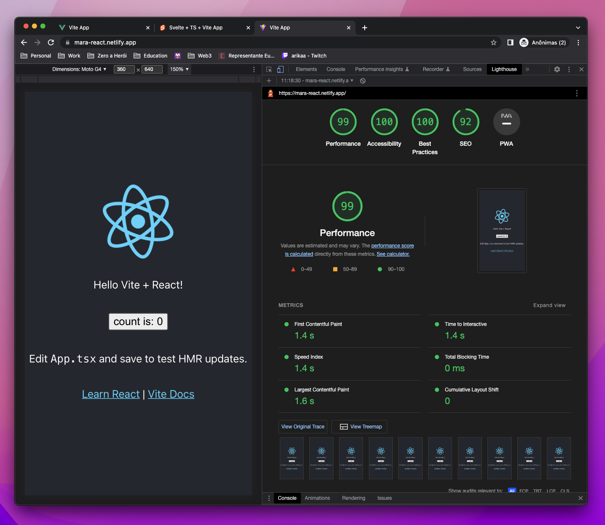
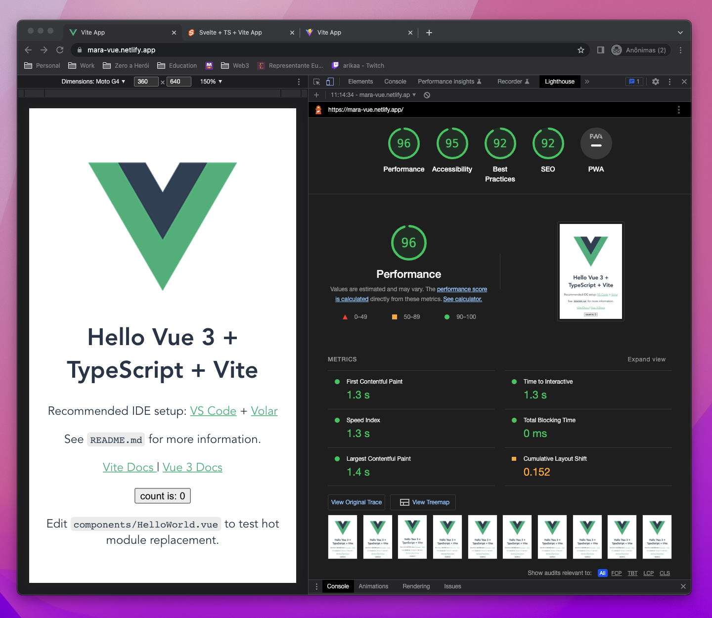
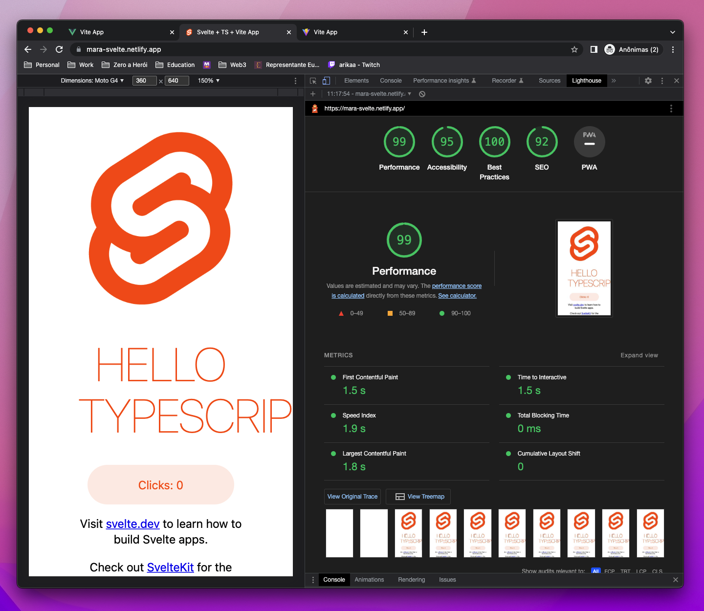
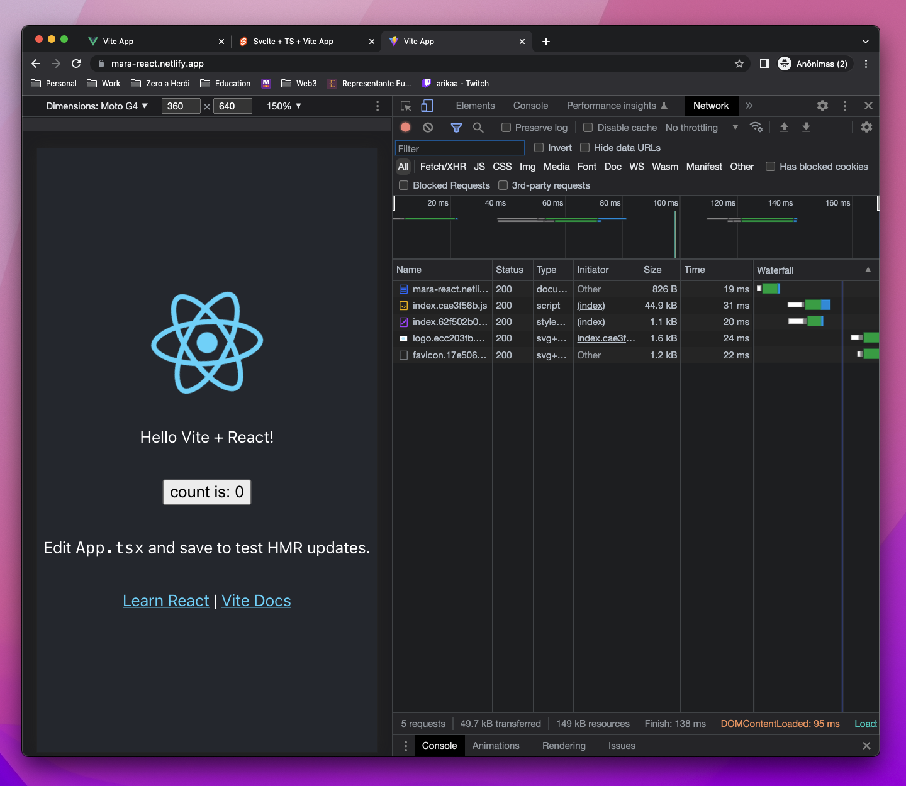
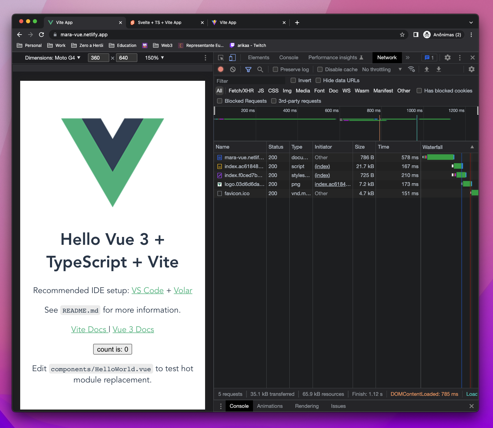
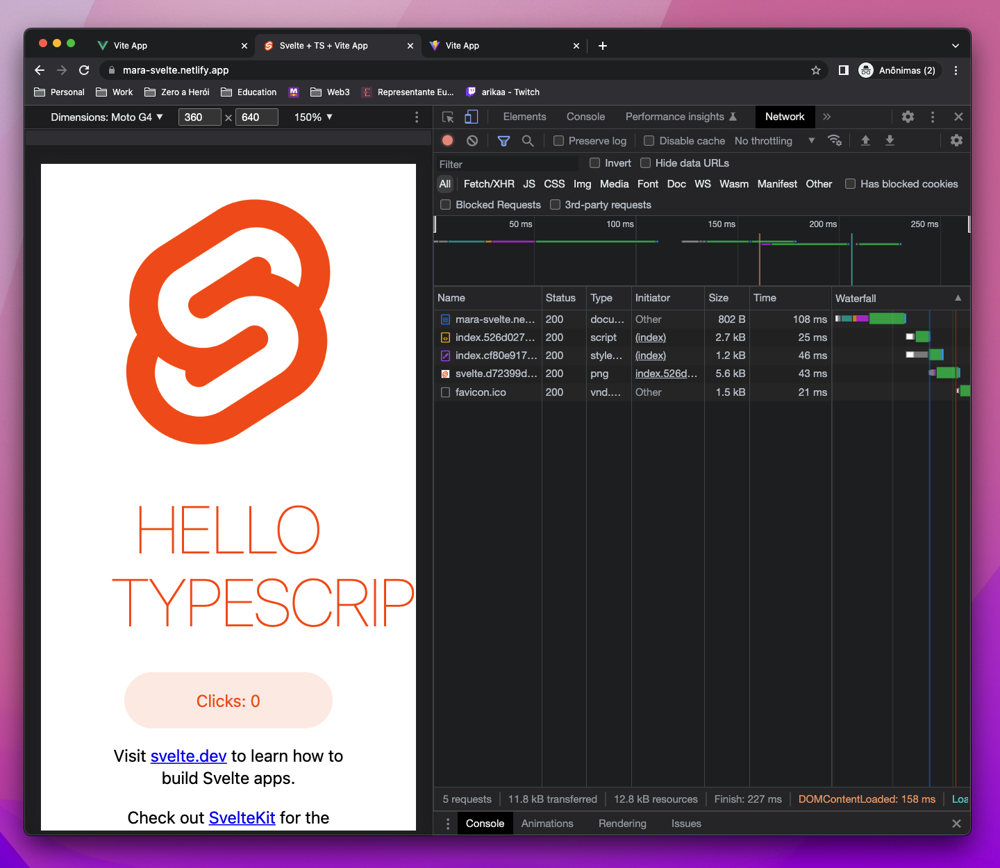
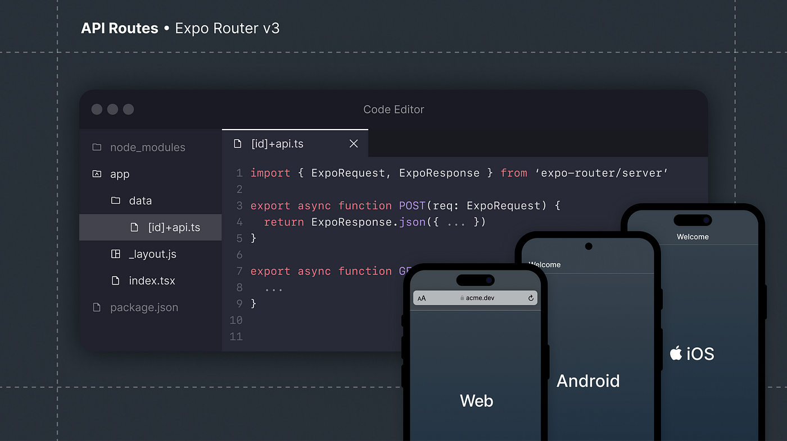

# 🧪 &nbsp; Research: Modern Front-end Proposal

## Sumário

- [Rebranding](#)
  - [Design System Ops](#)
  - [Server Driven UI](#)
- [Requisitos Funcionais](#)
- [Requisitos Não Funcionais](#)
- [Front-end Frameworks Benchmarks](#)

---

#### Brainstorm

- A/B Tests
- AI: V0 Vercel
- Acessibilidade
- Atomic Design
- Avaliação de impacto e processos Throughputs
- Funil de Eventos
- Headless CMS: Drupal, Prismic, Hygraphq
- Lighthouse
- Product Requirements
- Páginas institucionais de marketing
- Rebranding
- SEO, Core Web Vitals
- Server Driven UI
- Shadcn/UI, Tailwind, React, NextJS
- Site Studio Acquia
- Storybook
- Turbo Repo

## Rebranding

### Design System Ops

> Um sistema de design fornece aos designers e engenheiros as ferramentas necessárias para construir e escalar produtos de forma rápida, coerente e consistente. Mais do que uma coleção de componentes, ele oferece documentação, melhores práticas, princípios e diretrizes para garantir que os membros da equipe entreguem produtos que atendam aos requisitos de marca e usabilidade​

- **Referências**:
  - [The Ins and Outs of Design System Ops](https://www.uxpin.com/studio/blog/design-system-ops/)​
  - [Sell investment, not cost - The Never-Ending Job of Selling Design Systems](https://alistapart.com/article/selling-design-systems/)
  - [Team Models for Scaling a Design System](https://medium.com/eightshapes-llc/team-models-for-scaling-a-design-system-2cf9d03be6a0)

---

### Server Driven UI

> A Server Driven UI é uma abordagem em que a estrutura e o conteúdo da interface do usuário são controlados pelo servidor, em vez de estar embutidos no código do aplicativo. Isso significa que em vez de criar e atualizar telas no lado do cliente, as instruções para a construção da interface são enviadas do servidor para o aplicativo. Essencialmente, a lógica da interface é transferida do cliente para o servidor.

- **Referências**:
  - [A Deep Dive into Airbnb’s Server-Driven UI System](https://medium.com/airbnb-engineering/a-deep-dive-into-airbnbs-server-driven-ui-system-842244c5f5)
  - [Conheça o Beagle: A evolução do Server-Driven UI](https://medium.com/@Uziasf/conhe%C3%A7a-o-beagle-a-evolu%C3%A7%C3%A3o-do-server-driven-ui-2a57cb8d81ff)
  - [Build better experiences with server-driven UI](https://www.deptagency.com/insight/build-better-experiences-with-server-driven-ui/)
  - [Dynamic screens using server-driven UI in Android](https://proandroiddev.com/dynamic-screens-using-server-driven-ui-in-android-262f1e7875c1)
  - [Android Server Driven UI](https://engineering.q42.nl/android-server-driven-ui/)

---

## Requisitos Funcionais 🚀

- **Design System Componentizável:**

  - Desenvolvimento de componentes reutilizáveis com React: Permite criar componentes dinâmicos e interativos que podem ser facilmente compartilhados e reutilizados. 🛠️

    

- Documentação e gerenciamento desses componentes via Storybook: Utilizar Storybook para documentar os componentes, facilitando a compreensão e a reutilização por desenvolvedores e designers. 📚

- **Referências**:

  - [Circuit UI](https://circuit.sumup.com/?path=/docs/introduction-welcome--docs)
  - [Frontend at scale](https://increment.com/frontend/frontend-at-scale/)

---

- **Server Driven UI:**

  - Implementação de UIs renderizadas ou adaptadas pelo servidor: Melhorar a personalização e performance da interface do usuário através da renderização ou adaptação do lado do servidor. 🌐

---

- **Headless Drupal:**

  - Configuração do Drupal em modo headless para gerenciamento de conteúdo através de APIs: Separar a camada de gerenciamento de conteúdo da apresentação para facilitar a distribuição multicanal. 📡

  - Benefícios:
    - **Edição Fluida**: Visualização em linha integrada à interface de edição.
    - **Publicação Instantânea**: Novos conteúdos e atualizações são publicados instantaneamente.
    - **Multi-site**: Potencialize vários sites Next.js a partir de um único site Drupal.
    - **Autenticação**: Autenticação com suporte para funções e permissões.
    - **Webforms**: Formulários React criados com suporte do módulo Webform.
    - **API de Busca**: Suporte para busca facetada desacoplada, alimentada pela API de Busca.
    - **Internacionalização**: Tradução embutida e detecção automática de idioma.
    - **Desempenho**: Implante e escale seus sites através de redes de entrega de conteúdo.
    - **Segurança**: Proteja seu site de ataques separando o código da interface.

- **Referências**:

  - [The future of Drupal is headless](https://next-drupal.org/)
  - [Headless CMS Use Cases](https://prismic.io/blog/headless-cms-use-cases)​.
  - [20 Best Website CMS Platforms in 2024](https://prismic.io/blog/website-cms-platforms)

---

- **SEO e Core Web Vitals:**

  - Otimização para motores de busca e indicadores de Core Web Vitals: Implementar estratégias de SEO e otimizar o site de acordo com os Core Web Vitals para melhorar o posicionamento nos motores de busca e a experiência do usuário. 🔍

- **Referências**:

  - [NextJS & Core Web Vitals](https://nextjs.org/learn-pages-router/seo/web-performance/seo-impact)
  - [Web Vitals](https://web.dev/articles/vitals?hl=pt-br)

---

- **A/B Tests:**

  - Suporte para realização de testes A/B: Permitir a realização de testes A/B para otimizar a experiência do usuário com base em dados reais. 🧪

---

- **Acessibilidade:**

  - Desenvolvimento seguindo as diretrizes de acessibilidade WCAG: Assegurar que o site seja acessível a todos os usuários, cumprindo com as normas internacionais de acessibilidade. ♿

---

- **Estilização com Shadcn/UI e Tailwind CSS:**

  - Uso de Shadcn/UI e Tailwind para construção e estilização de interfaces: Empregar essas ferramentas para agilizar o desenvolvimento e garantir a consistência visual. 🎨

  - <a href="https://www.figma.com/file/fITy0KvhCVJfMMizMpsdAE/%40shadcn%2Fui---Design-System-(Community)?type=design&node-id=2-287&mode=design&t=G3KqYhD6nk5XIpwg-0" title="Figma" align="center">Figma - Shadecn/UI</a>

---

- **Desenvolvimento com React e NextJS:**

  - Uso do React para componentes dinâmicos e NextJS para melhorias em SSR/SSG: Utilizar essas tecnologias para construir uma experiência de usuário rápida e eficiente, melhorando a performance e o SEO. ⚛️

  - **Referências**:
    - [Monitoring your Core Web Vitals](https://nextjs.org/learn-pages-router/seo/monitor/nextjs-speed-insights)
    - [Why Choose Next.js - Top 5 Performance Benefits](https://cult.honeypot.io/reads/top-nextjs-performance-benefits/)

---

## Requisitos Não Funcionais 💡

- **Consistência Visual:**

  - Manter uma experiência de usuário coesa e alinhada à identidade da marca através do uso consistente do Design System. 👁️‍🗨️

---

- **Eficiência na Gestão e Redução de Custos:**
  -Minimizar os custos de desenvolvimento e manutenção por meio da reutilização de componentes e otimização dos processos de trabalho. 💸

  - [One Formula To Rule Them All: The ROI Of A Design System](https://www.smashingmagazine.com/2022/09/formula-roi-design-system/)

---

- **Flexibilidade e Controle para Gestores de Conteúdo:**
  Garantir que os gestores de conteúdo mantenham controle operacional e flexibilidade, mesmo com a adoção de soluções headless. 🎮

---

- **Suporte Multicanal:**
  Facilitar a entrega de conteúdo por diversas plataformas, aproveitando a configuração headless do Drupal. 📲

---

- **Performance e Escalabilidade:**

  - Assegurar altos níveis de desempenho e a capacidade de escalar recursos conforme necessário, focando particularmente na otimização para Core Web Vitals. 🚀

---

- **Colaboração entre Equipes:**

  - Fomentar a colaboração efetiva entre equipes de design e desenvolvimento, especialmente por meio do uso de ferramentas como Storybook. 👥
  - [https://designsystemsbrasileiros.com/](https://designsystemsbrasileiros.com/)

---

## 🥞 &nbsp; Frameworks/Toolchains - Inicialização Padrão 

Implementação padrão da página de inicialização dos respectivos frameworks, utilizando **vite**.
 

  

  

  

---

## 🧪 &nbsp; Front-end Frameworks Benchmarks

  

		Análises de experimentos utilizando os principais frameworks / toolchains para desenvolvimento de front-end disponíveis no mercado: <strong><a href="https://pt-br.reactjs.org/">React</a></strong>, <strong><a href="https://vuejs.org/">Vue</a></strong> e <strong><a href="https://svelte.dev/">Svelte</a></strong>.
  

#### 🏎️ &nbsp; React vs Vue vs Svelte - Benchmarking 

Comparação entre os frameworks React, Vue e Svelte, **mobile-first**, **cache desabilitado** em modo anônimo.

---

#### ​ Lighthouse Report 

> Critérios como acessibilidade, melhores práticas e SEO são relativos, uma vez que as páginas de welcome screen implementam boilerplates superficiais.

| Critério          | React  | Vue   | Svelte |
| ----------------- | ------ | ----- | ------ |
| Performance       | 99 🟢  | 96 🔻 | 99 🟢  |
| Acessibilidade    | 100 🟢 | 95 🔻 | 95 🔻  |
| Melhores Práticas | 100 🟢 | 92 🔻 | 100 🟢 |
| SEO               | 92     | 92    | 92     |

    
		 
    
		 
    
		 

#### ​ Network Report 

> Recursos como favicon, imagens e CSS foram ignorados por se tratarem de assets adicionais e diferentes entre as welcome screens de cada uma das soluções.

|       Critério (Tamanho)       |   React    |    Vue     |  Svelte   |
| :----------------------------: | :--------: | :--------: | :-------: |
|         Documento HTML         |  826 B 🔻  |  766 B 🟢  | 802 B 🟡  |
|       Javascript Bundle        | 44.9 kB 🔻 | 21.7 kB 🟡 | 2.7 kB 🟢 |
|      Nº de Requisições\*       |     5      |     5      |     5     |
|      Tamanho de Recursos       |  49.7 kB   |  35.1 kB   |  11.8 kB  |
| Tempo de Carregamento do DOM\* |   95 ms    |   785 ms   |  158 ms   |

    
		 
    
		 
    
		 

---

## Expo Dev

    

O Expo é uma plataforma para o desenvolvimento de aplicativos nativos para Android, iOS e web usando React Native, facilitando o acesso a APIs nativas sem necessidade de configuração adicional. O expo-dev-client é um pacote do Expo que permite integrar dependências nativas em projetos, oferecendo uma experiência de desenvolvimento ampliada. O Expo CLI é uma ferramenta de linha de comando que agiliza o desenvolvimento, permitindo iniciar servidores, gerar diretórios nativos, e compilar apps localmente.

- **Referências**:
- [Expo Dev](https://expo.dev/)
